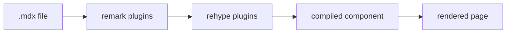

## Why a Monorepo

<Decision title="pnpm workspaces, not Turborepo or Nx">
  This site is a pnpm workspace monorepo: `apps/portfolio` and `apps/blog`,
  sharing a handful of thin config packages. pnpm's strict `node_modules`
  prevents phantom dependencies across shared packages — a real correctness
  concern, not a trend pick. A task runner (Turborepo, Nx) was deliberately
  deferred until there's an actual expensive build graph to justify one.
</Decision>

The repo's shared packages only cover config — TypeScript, ESLint, and a
Tailwind preset — extracted at the exact moment the blog needed them, not
before:

<FileTree>
  <FileTreeFolder name="apps">
    <FileTreeFolder name="portfolio" />
    <FileTreeFolder name="blog" />
  </FileTreeFolder>
  <FileTreeFolder name="packages">
    <FileTreeFolder name="config-typescript" />
    <FileTreeFolder name="config-eslint" />
    <FileTreeFolder name="config-tailwind" />
  </FileTreeFolder>
</FileTree>

## The Content Loader

Frontmatter is validated with a small Zod schema — deliberately _not_
including a `type` field:

```ts
const frontmatterSchema = z.object({
  title: z.string().min(1),
  date: z.string().date(),
  tags: z.array(z.string()),
  excerpt: z.string().min(1),
  draft: z.boolean().default(false),
});
```

<Note title="type is derived, not authored">
  `type` (post/project/adr) comes from which content directory a file lives in,
  not a hand-typed frontmatter field. A file can never claim a type that
  disagrees with its own location — an entire class of author error removed for
  free.
</Note>

<Tradeoff title="Code-splitting doesn't fully work yet">
  The loader uses separate eager globs for metadata (title, reading time) so
  listing posts doesn't require bundling every post's full compiled component.
  The intent was real per-post code-splitting too — but Rollup keeps a module in
  the main chunk the moment anything statically imports it, even if a separate
  dynamic import exists for the same path. Harmless at today's content volume; a
  real fix is scoped to a later performance pass.
</Tradeoff>

<Warning title="A dependency that crashes in the browser">
  Reading time was first computed with the `reading-time` npm package. Its main
  entry unconditionally requires a Node-only stream submodule, which crashes the
  entire app once bundled for the browser — `stream` gets externalized to
  nothing, and `class X extends Transform` throws the moment the module loads.
  The fix: drop the dependency, hand-roll the ~5-line calculation instead. Unit
  tests didn't catch it; only a real production build did.
</Warning>

<Tip title="Reuse proven AST-injection utilities">
  Reading time also needed a way to expose data as an MDX export at compile
  time. Rather than hand-building the AST node, a small custom remark plugin
  reuses `unist-util-mdx-define` — the exact utility `remark-mdx-frontmatter`
  itself uses for its own `frontmatter` export.
</Tip>

## Running It Locally

<Terminal>
  pnpm install{"\n"}
  pnpm --filter blog dev
</Terminal>

## The Compile Pipeline


