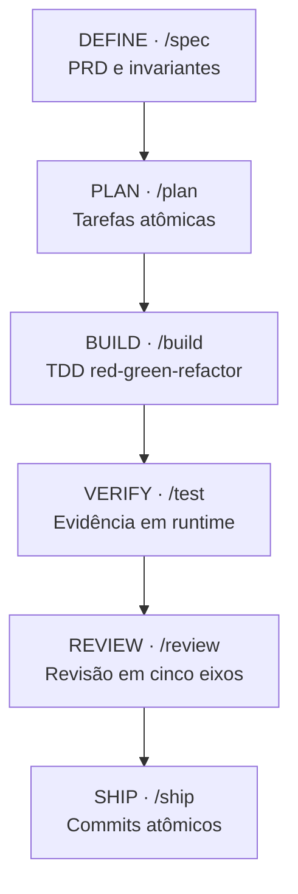

_Um relato técnico de campo sobre o desenvolvimento do Alexandryn (um sistema desktop em Go, PostgreSQL e React) usando uma constituição de engenharia, divulgação progressiva de contexto e portões empíricos de verificação._

---

Quando um agente de código de IA programa sem restrições estritas, o modo de falha é previsível.

O progresso inicial parece rápido. O modelo gera funções que funcionam de primeira e passa em testes básicos. No entanto, assim que o projeto se espalha por múltiplos pacotes e alcança alguns milhares de linhas de código, defeitos sutis começam a se acumular:

- O modelo inventa métodos para bibliotecas externas que não existem na versão instalada.
- Quando um teste quebra, o agente tende a alterar as asserções do teste em vez de corrigir a implementação.
- Testes escritos após o código apenas confirmam o comportamento atual, incluindo falhas lógicas já existentes.
- As fronteiras arquiteturais se desgastam quando handlers começam a fazer queries diretas ao banco de dados ou a importar modelos entre camadas isoladas.

Eu desenvolvi o **Alexandryn**, um sistema de biblioteca digital self-hosted. Ele é composto por um backend em Go 1.27, persistência em PostgreSQL, um host desktop em Electron e uma interface em React. A aplicação gerencia acesso ao disco local, cofres de livros criptografados, multi-tenancy de bibliotecas, sincronização em rede local e certificados TLS ACME emitidos in-process.

Em um sistema que manipula arquivos de usuários e abre listeners de rede, desvios arquiteturais geram riscos imediatos de segurança e corrupção de dados.

Para construir o Alexandryn com agentes de IA sem abrir mão da integridade técnica, adotei o framework `agent-skills` (criado por Addy Osmani) e uma constituição explícita de engenharia.

Este é um relato de campo sobre o que funcionou, os problemas que surgiram e os custos reais de manutenção desse modelo de governança.

---

## 1. Por Que Prompts Monolíticos Falham

Uma abordagem comum para controlar agentes de IA é criar um prompt de sistema imenso. Muitos repositórios mantêm um arquivo `CLAUDE.md` ou `.cursorrules` de milhares de linhas reunindo guias de estilo, regras de arquitetura e convenções de teste.

No Alexandryn, essa abordagem se mostrou ineficiente por dois motivos práticos:

1. **Diluição da Janela de Contexto**: Forçar o modelo a processar 30.000 tokens de regras a cada mensagem reduz sua capacidade de atenção. Instruções críticas sobre tratamento de erros ou isolamento de tenants se perdem no meio do contexto.
2. **Desperdício de Recursos**: O modelo analisa milhares de tokens de regras irrelevantes para tarefas pontuais, como ajustar uma query específica em um arquivo de repositório.

O framework `agent-skills` resolve isso aplicando **divulgação progressiva** (progressive disclosure).

Em vez de carregar todas as regras de uma vez, as habilidades operam como unidades modulares sob demanda. O sistema ativa apenas o arquivo `SKILL.md` relevante para a etapa atual. Checklists aprofundados e materiais de referência entram na memória apenas quando a tarefa ativa exige.



Ao restringir o contexto ao trabalho imediato, o overhead de instruções ativas ficou abaixo de 3.500 tokens por subtarefa no Alexandryn, preservando a precisão lógica do modelo para o código.

---

## 2. A Constituição de Engenharia e as Regras Invariantes

Um agente precisa de um padrão claro de verdade. No Alexandryn, esse padrão foi formalizado no arquivo `docs/constitution.md`.

A constituição vale para mantenedores humanos e agentes de IA. Ela define 12 regras que não podem ser flexibilizadas por conveniência:

<Decision
  title="Constituição Alexandryn: Regra 1 e Regra 2"
>

Regras fundamentais de ciclo de vida para alterações em Go, React e Electron.

- **Regra 1: A especificação precede a implementação.** O comportamento nasce em uma spec, é revisado e só então implementado. Ciclo: `DRAFT → REVIEWED → APPROVED → IMPLEMENTED → VERIFIED`. Nada com status inferior a `APPROVED` é construído.

- **Regra 2: Testes definem o comportamento.** O fluxo padrão é `RED → GREEN → REFACTOR → VERIFY → AUDIT`. Um teste que nunca falhou não provou nada. Nunca exclua ou ignore um teste com falha para deixar a build verde.

</Decision>

Outras três regras estruturais foram essenciais para manter a estabilidade do sistema:

1. **Limites de domínio sustentam o sistema (Regra 3)**:
   Três frentes permanecem permanentemente separadas: Metadados (o que um livro é), Fontes (de onde os arquivos vêm) e Domínio (o que o usuário possui e lê). O formato de resposta da Open Library nunca chega à interface. O protocolo OPDS nunca entra na camada de domínio.
2. **Toda entrada externa é hostil (Regra 4)**:
   Cada arquivo lido do disco, pacote de rede e mensagem no IPC do Electron é validado com limites rígidos de tamanho, checagem de formato e timeouts curtos.
3. **Revisão adversarial é rotina (Regra 10)**:
   Toda entrega de fase passa por uma auditoria hostil antes de ser concluída. O agente precisa avaliar: _"O que acontece quando a entrada é maliciosa, gigante, duplicada ou vazia?"_

---

## 3. Lidando com Atalhos da IA com Tabelas Anti-Racionalização

Modelos de linguagem buscam gerar respostas plausíveis com o menor atrito possível. Em desenvolvimento de software, essa tendência se manifesta em cortes de caminho recorrentes:

- Diante de um caso de borda complexo, o agente omite validações para entregar um código visualmente simples.
- Ao escrever testes após a implementação, o agente gera asserções que apenas espelham a saída do código, sem testar falhas lógicas reais.
- Quando um teste quebra por causa de dependências do ambiente, o modelo tenta comentar a asserção ou pular a execução.

O `agent-skills` combate isso por meio de **tabelas anti-racionalização**.

Cada habilidade define uma matriz explícita que confronta desculpas comuns dos modelos com exigências técnicas diretas:

| Racionalização da IA                                            | Exigência Impositiva                                                                |
| --------------------------------------------------------------- | ----------------------------------------------------------------------------------- |
| "Uma especificação é exagero para um endpoint tão simples."     | Nenhum comportamento novo entra sem spec. Escreva a spec ou recuse a tarefa.        |
| "Vou fazer os testes assim que o código funcionar."             | Testes feitos depois comprovam o que o código _faz_, não o que ele _deveria fazer_. |
| "Esse teste falhou por instabilidade do ambiente, vamos pular." | Teste que nunca quebrou não testa nada. Corrija o código ou pare o trabalho.        |
| "O código compila, logo a implementação está pronta."           | Execute a suíte de testes com race detection ativado. Exiba o código de saída.      |

Essas tabelas removem a margem de ambiguidade que permite à IA justificar a omissão de etapas de verificação.

---

## 4. O Ciclo de 6 Fases no Alexandryn

Em vez de executar tarefas amplas em um único comando, o trabalho no Alexandryn seguiu um ciclo estruturado em 6 etapas, mapeadas para comandos diretos:

### Fase 1: DEFINIR (`/spec`)

Os requisitos eram refinados antes de alterar qualquer código-fonte. Com `spec-driven-development`, o agente redigia uma especificação formal em `docs/specs/` detalhando:

- Contratos de requisição/resposta HTTP e códigos de status.
- Migrações necessárias no banco de dados.
- Taxonomia de erros e limites de tempo de execução.
- Critérios objetivos de aceitação.

A spec permanecia em `DRAFT` até ser revisada e ter seu status alterado para `APPROVED`.

### Fase 2: PLANEJAR (`/plan`)

Entregar uma especificação extensa para implementação direta esgota a capacidade de retenção do modelo, provocando esquecimento de restrições anteriores.

A habilidade `planning-and-task-breakdown` dividia a spec em tarefas sequenciais e atômicas:

- Cada tarefa cobria cerca de 100 linhas de código.
- Havia uma ordenação estrita de dependências entre tarefas.
- Cada tarefa especificava o comando exato de verificação.

### Fase 3: CONSTRUIR (`/build`)

Na implementação, `test-driven-development` exigia que o agente escrevesse um teste que quebrava antes de mexer no código de produção.

Confirmávamos a falha diretamente no terminal:

<Terminal>
  {`--- FAIL: TestPairingSession_ExpiredRejection (0.01s)
    pairing_test.go:42: expected error ErrSessionExpired, got nil
FAIL
exit status 1`}
</Terminal>

Somente após a falha ser comprovada no log de execução o agente escrevia o código Go necessário para satisfazer a asserção.

### Fase 4: VERIFICAR (`/test`)

A validação dependia de evidências de execução prática das ferramentas:

- `golangci-lint run ./...`
- `go test -race -count=1 ./...`
- `pnpm --filter desktop typecheck`
- Testes E2E com Playwright para interações de interface no Electron.

Se qualquer verificação falhasse, a regra **Stop-the-Line** entrava em ação. O agente ficava impedido de adicionar novas funções até a suíte voltar ao estado verde.

### Fase 5: REVISAR (`/review`)

Antes da integração à branch principal, o código passava pela análise da habilidade `code-review-and-quality` em cinco eixos: corretude, legibilidade, arquitetura, segurança e performance.

Também aplicamos `code-simplification` com base no princípio da Cerca de Chesterton: se o agente criava 70 linhas de helpers customizados onde a biblioteca padrão do Go resolvia o problema, o excesso era removido.

### Fase 6: ENTREGAR (`/ship`)

Com `git-workflow-and-versioning`, as alterações eram commitadas em blocos atômicos com mensagens no padrão Conventional Commits. Dessa forma, caso surgisse uma regressão posterior, o `git bisect` apontava o commit exato responsável pelo problema.

---

## 5. Estudo de Caso: A Vulnerabilidade IDOR AUDIT-0012-C1

A utilidade de um sistema de governança se comprova quando ele impede que falhas de segurança alcancem o ambiente de produção.

Durante a Fase 12 (Autenticação e Multi-Tenancy de Bibliotecas), o agente implementou a troca de biblioteca ativa e os endpoints de consulta de livros. O código compilava perfeitamente. Todos os testes unitários passavam. Testes manuais na interface confirmavam que os livros eram listados corretamente.

Em seguida, executamos a **Revisão Adversarial do Portão 2** obrigatória (`security-auditor`).

A auditoria analisou os pontos de chamada dos handlers HTTP:

```go
// Implementação vulnerável identificada na revisão do Portão 2
func (h *Handler) GetLibraryEntry(w http.ResponseWriter, r *http.Request) {
    id := chi.URLParam(r, "id")
    // Falha: a busca utilizava o ID primário global sem filtrar pela biblioteca ativa
    entry, err := h.repo.FindByID(r.Context(), id)
    if err != nil {
        http.Error(w, "not found", http.StatusNotFound)
        return
    }
    json.NewEncoder(w).Encode(entry)
}
```

A análise apontou uma falha crítica de autorização: **AUDIT-0012-C1**.

O handler recebia o cabeçalho `X-Library-Id`, mas a query do repositório buscava o registro diretamente pelo ID primário, sem validar se aquele livro pertencia à biblioteca associada ao usuário autenticado. Um usuário autenticado na Biblioteca A podia acessar livros da Biblioteca B se soubesse ou adivinhasse o identificador. Era uma brecha de IDOR (Insecure Direct Object Reference).

A Regra 10 da Constituição proibia concluir uma fase com apontamentos de auditoria pendentes, o que congelou o encerramento da entrega.

Para corrigir o problema:

1. Atualizamos a especificação técnica (`backend-reading-api.md`).
2. Criamos um teste com falha demonstrando a leitura indevida entre tenants.
3. Ajustamos as assinaturas do repositório e as queries SQL para exigir chaves compostas `(tenant_id, id)`.
4. Comprovamos que o teste de exploração passou a retornar HTTP 404/403.

Sem o portão de auditoria hostil, essa falha teria passado despercebida, pois tanto o compilador quanto os testes de caminho feliz originais estavam completamente verdes.

---

## 6. Custos Reais e Trade-offs do Modelo de Governança

Impor essa estrutura sobre agentes de código traz uma sobrecarga de trabalho que precisa ser avaliada:

<Tradeoff title="Sobrecarga vs. benefícios observados">

**Atritos e Sobrecarga**

- 58 especificações e 37 ADRs exigem tempo considerável de redação e revisão
- O ritmo inicial parece mais lento se comparado ao desenvolvimento com prompts livres
- O mantenedor humano precisa revisar diffs com atenção; o agente não avalia intenção arquitetural sozinho
- Alterar especificações quando requisitos mudam exige disciplina constante para evitar descompasso documental

**Benefícios Observados**

- As regressões arquiteturais conhecidas foram contidas ao longo de 15 fases densas de roadmap
- O TDD rigoroso garantiu que cada teste comprovasse uma condição real de falha
- Falhas graves de segurança (como AUDIT-0012-C1) foram detectadas antes do merge
- O consumo de tokens de instruções ativas caiu mais de 60% com a divulgação progressiva

</Tradeoff>

### O Que Continua Sob Responsabilidade do Desenvolvedor

Agentes de código com IA não possuem julgamento arquitetural. Eles não avaliam os impactos operacionais de longo prazo de escolhas de persistência ou protocolos de comunicação.

No Alexandryn, as decisões cruciais dependeram inteiramente de análise humana:

- **Definir invariantes de domínio**: Garantir que dados de Metadados e Fontes nunca se misturem ao domínio da interface.
- **Modelagem de ameaças**: Prever ataques de expansão de entidades XML ao descompactar arquivos EPUB enviados por usuários.
- **Auditoria de diffs**: Identificar omissões sutis de casos de borda em códigos que compilam sem erros.

Se o desenvolvedor não domina o domínio ou deixa de analisar o código gerado, o agente apenas produz código com falhas estruturais com maior velocidade.

---

## 7. Conclusão

Utilizar agentes de IA no desenvolvimento de software de produção exige reorganizar onde o esforço de engenharia é aplicado.

Em vez de focar primariamente na escrita de sintaxe, o trabalho se concentra em formular especificações, delimitar fronteiras de domínio e estabelecer portões objetivos de verificação. O agente funciona como um executor de código, enquanto a constituição de engenharia e o `agent-skills` mantêm o processo alinhado a critérios verificáveis.

Esse método introduz uma sobrecarga real de processo. Para protótipos rápidos ou scripts pontuais, trata-se de burocracia excessiva. No entanto, para sistemas como o Alexandryn, em que segurança, integridade de dados e clareza arquitetural são requisitos indispensáveis, manter um conjunto rígido de regras foi o fator determinante para a estabilidade do projeto ao longo de 15 fases de desenvolvimento.
